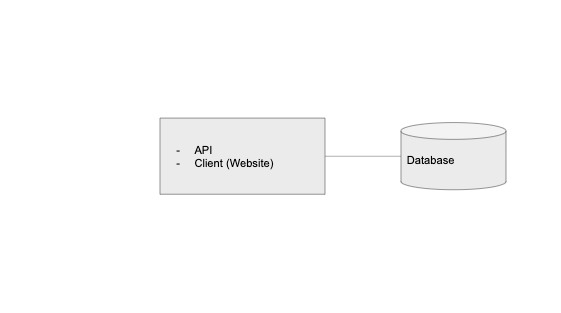
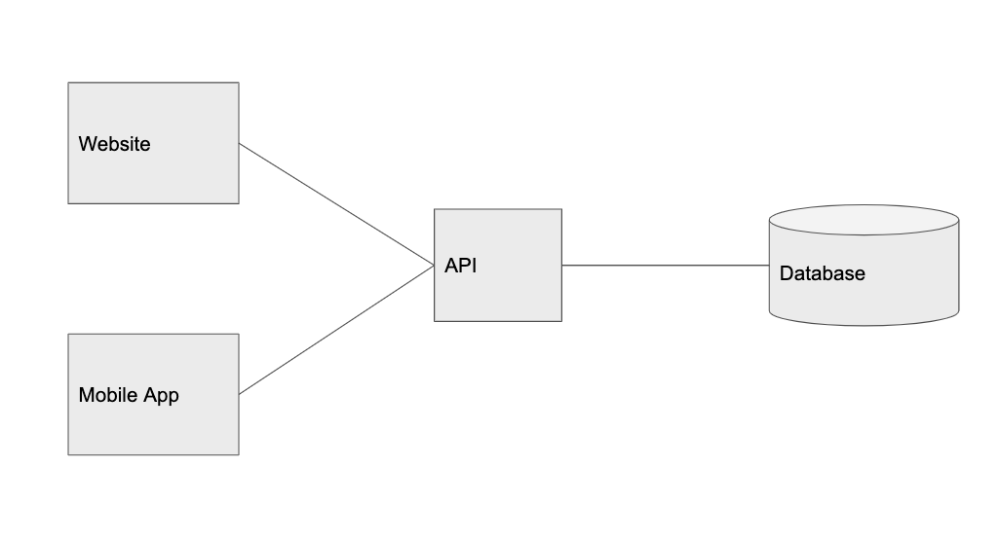
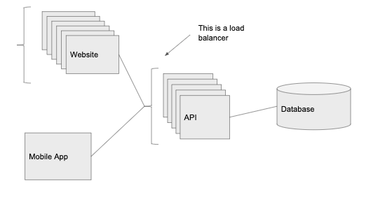
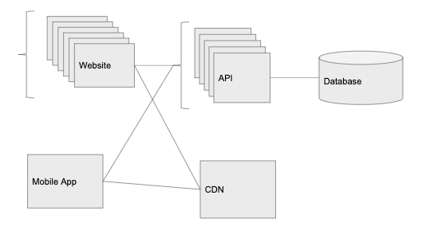
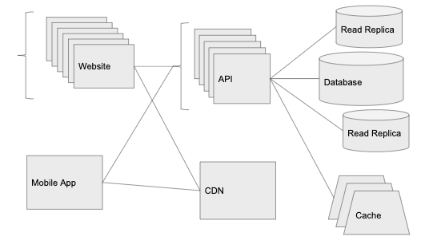

# Scaling to 100K Users [link](https://alexpareto.com/scalability/systems/2020/02/03/scaling-100k.html)

以Graminsta为例，看从side project到scalable，是否有迹可循。

## 1 user - 本地部署
Client, API 和 Database都在同一台机器上。
- client: app or website
- Database: persist data
- API: serves requests for and around data

## 10 user - 分离database layer
使用Amazon's RDS或Digital Ocean这一类的Managed Database。这比self-hosting在单机或EC2 instance要expensive一些，但有很多可以直接用的add-on能解决不少问题。
- multi-region redundancy
- read replicas
- automated backups, etc

## 100 user - 分离 client layer
拆分实体是构建scalable app的关键所在。如果系统的某一部分获得了更高的流量，则需要把它拆分出来，根据它的traffic特点来handle scaling the service.
这里拆分client层的原因：因为有不同的客户端（mobile、web等）都在consume同一api.

## 1,000 user - 加 load balancer
瓶颈：无法handle激增的流量。 
方法：在api层前加load balancer， route traffic to an instance of the service
优点：
- 可以handle更多traffic
- 系统容错率更高（1 instance down, system will not down）
- autoscaling (more instance during superbowl, less instance when users are asleep)

## 10,000 user - CDN
瓶颈：serving and uploading all imgs is too much for the server
方法：
- use cloud storage service to host static content (于是api可以不用再serve image/video upload). CDN is out of box for cloud storage service(AWS -> Cloudfront)
优点：
- CDN可以将image cache到世界各地不同的data center，提速

## 100,000 users - scaling data layer 
瓶颈：traffic继续增加，开始有很多timeout（因为database cpu is hovering at 80% ~ 90%）。需要scale database layer，但并非像api层加几个instance就可以了

### 方法一：为系统引入Cache Layer
使用Key value store like Redis or Memcached。（不少云服务有此功能:AWS - Elasticache, Google Cloud - Memorystore）
适用：适用于重复call database for same information。

优点：
- 减少DB访问次数（访问DB一次，存到cache中，再也不用因此访问DB。eg. request popular account every 30s）
- cache方便scale（Redis有built-in Redis Cluster mode，像load balancer一样将cache分到不同machine上）

### 方法二：使用Read Replicas
Read replica - stay up to date with master DB.(托管服务能一键完成) Available for SELECT statement

## 展望
- 继续将不同的模块拿出来scale(split out services that can be scaled independently)